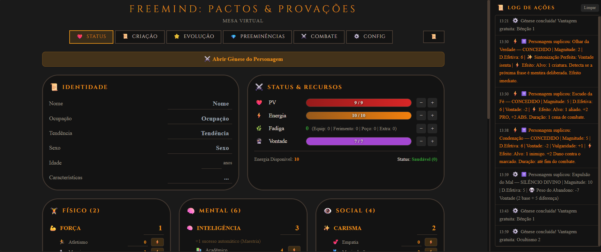
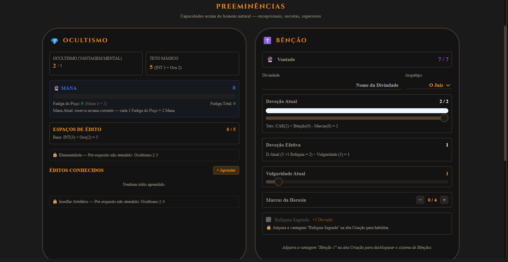
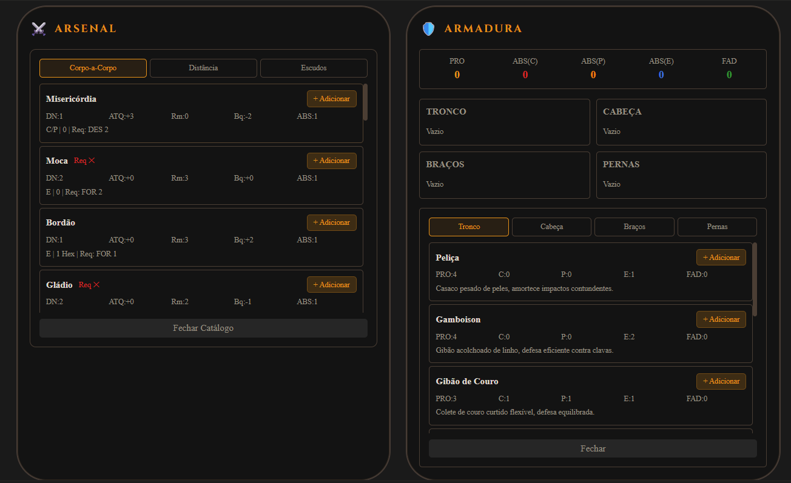
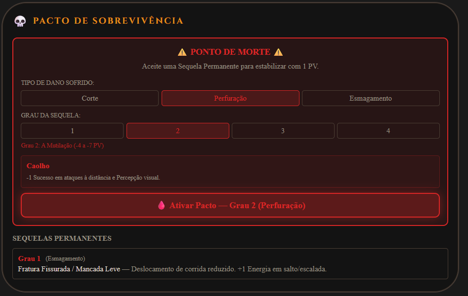

# Freemind: Pactos & Provações — Digital VTT Experience 🎲

Este repositório contém o código-fonte de uma plataforma de **Mesa Virtual (VTT)** customizada, desenvolvida no **Lovable** (React + Tailwind CSS + TypeScript). O projeto é uma implementação digital fiel do sistema de RPG **Freemind**, focada na "Gestão do Desespero" e na economia de recursos estratégicos.

## 🚀 Diferencial Tecnológico: Engine de Investimento
Diferente de VTTs convencionais baseados em sorte (dados), esta plataforma implementa um **Motor de Resolução por Investimento**:
*   **Regra de Ouro:** Automação da lógica `1 Ponto de Energia = 1 Sucesso`[cite: 1].
*   **Teto Dinâmico:** Restrição de injeção de energia baseada no valor absoluto do Atributo[cite: 1].
*   **Cálculo de Maestria:** Soma automática de sucessos bônus para níveis 3 e 5 de Atributo[cite: 1].

---

## 🛠 Arquitetura do Sistema e Funcionalidades

### 1. Gestão Biométrica e de Recursos
O sistema processa em tempo real a saúde e o cansaço do personagem através de pilares interdependentes:
*   **Cálculos Automáticos:** Fórmulas dinâmicas para PV Máximo $((Pilar Físico + Vigor) \times 3)$ e Vontade $(3 + Pilar Social)$[cite: 1].
*   **Sistema de Fadiga Triple-Layer:** Recalcula a Energia do turno subtraindo Fadiga de Equipamento, Fadiga Traumática (baseada em % de PV) e Fadiga de Combate[cite: 1].

### 2. Módulo Sobrenatural (Ocultismo e Fé)
Interface complexa para gestão de poderes que desafiam a realidade:
*   **Poço de Mana:** Mecânica de conversão de Fadiga em Mana (proporção 1:2)[cite: 1].
*   **Motor de Súplicas:** Validação de Devoção Atual vs. Magnitude e cálculo automático de custo de Vontade[cite: 1].
*   **Teto Mágico:** Limitação de execução baseada em `Inteligência + Especialização`[cite: 1].

### 3. Arsenal e Sistema Modular de Armaduras
*   **Validação de Requisitos:** Verificação em tempo real de FOR/DES para uso de armas; aplicação automática de penalidade de +2 no custo de energia caso o requisito não seja atendido[cite: 1].
*   **Proteção por Camadas:** Soma modular de PRO e ABS (Corte, Perfuração, Esmagamento) baseada nas peças equipadas no Tronco, Cabeça e Extremidades[cite: 1].

### 4. Mecânicas de Sobrevivência e Social
*   **Interface de Pacto:** Sistema de "Ponto de Morte" que permite estabilização com 1 PV mediante a escolha de Sequelas Permanentes[cite: 1].
*   **Automação de Status:** Aplicação de redutores de teto (-2) para estados de "Inseguro" ou "Inquieto"[cite: 1].

---

## 📸 Demonstração Visual

### Painel Central e Status

*Visualização do log de ações e gestão de recursos vitais (PV, Energia, Vontade).*

### Sistemas de Poder e Combate
| Ocultismo e Devoção | Gestão de Arsenal |
| :---: | :---: |
|  |  |

### Mecânicas de Risco

*Interface crítica para seleção de Sequelas Permanentes em 0 PV.*

---

## ⚙️ Stack Técnica
*   **Frontend:** React.js com TypeScript.
*   **Estilização:** Tailwind CSS (Interface Dark Mode com paleta `#191919` e `#131313`)[cite: 1].
*   **Lógica de Negócio:** Engine de processamento de regras customizada em JS/TS.
*   **Plataforma de Desenvolvimento:** Lovable.

---
**Desenvolvido por Larissa Barbosa Pelissari (Lari)**  
*Transformando regras complexas de desespero em interfaces funcionais e imersivas.*